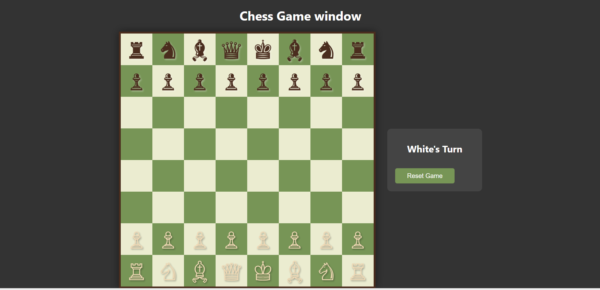

# Chess_Game
# Chess Game using HTML, CSS, jQuery & Ajax

A fully functional, browser-based chess game built from scratch as part of an academic micro-project. This project demonstrates core web development principles and features a complete implementation of chess rules and logic.

**[➡️ View Live Demo](https://chess-game-iota-neon.vercel.app/)**

---

## Screenshot

*(**Note to developer:** To add a screenshot, take a picture of your running game, name it `screenshot.png`, and upload it to your GitHub repository. It will then appear here automatically.)*



---

## Features

- **Interactive Chessboard:** A full 8x8 board with click-to-move functionality for an intuitive user experience.
- **Complete Rule Implementation:** All standard chess rules are enforced.
- **Move Validation:** The game validates moves for all six piece types (Pawn, Rook, Knight, Bishop, Queen, and King).
- **Illegal Move Prevention:** Prevents players from making moves that would illegally expose their king to check (handles pins correctly).
- **Game State Detection:** Automatically detects and announces key game states:
  - **Check:** Notifies the player when their king is under attack.
  - **Checkmate:** Ends the game and declares a winner.
  - **Stalemate:** Ends the game in a draw if a player has no legal moves but is not in check.
- **Polished UI:** Features a pre-game start screen and provides clear, non-intrusive feedback for invalid moves.
- **Game Controls:** Includes a "Start Game" and "Reset Game" button to control the gameplay session.

---

## Tech Stack

- **Frontend:** HTML5, CSS3, jQuery 3.7.1
- **Data Handling:** Ajax for asynchronously loading the initial board state from a `JSON` file.
- **Deployment:** Hosted on Vercel.

---

## How to Run Locally

1.  **Clone the repository:**
    ```bash
    git clone [https://github.com/your-username/chess-game-project.git](https://github.com/your-username/chess-game-project.git)
    ```
2.  **Navigate to the project directory:**
    ```bash
    cd chess-game-project
    ```
3.  **Open the `index.html` file** in your favorite web browser. No special server is required!

---

## File Structure

The project is organized into four simple and self-contained files:

- **`index.html`**: Contains the basic structure and layout of the webpage.
- **`style.css`**: Provides all the styling for the board, pieces, and user interface.
- **`script.js`**: The core of the project, containing all the game logic, rule enforcement, and interactivity, written using jQuery.
- **`pieces.json`**: Acts as a simple database to define the starting positions of all the pieces on the board. This file is fetched using an Ajax call when the game starts.
